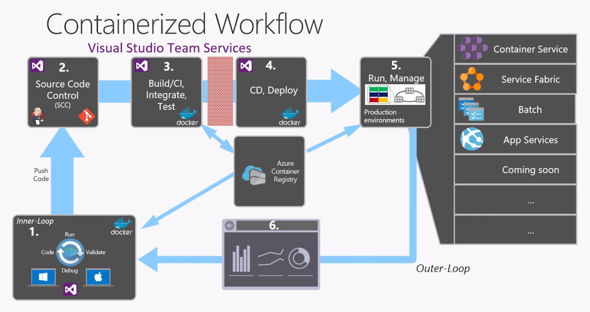

# AWS usergroup presentation

* David Burela
* Senior Technical Evangelist - Microsoft
* [@DavidBurela](https://Twitter.com/DavidBurela)

## Topics 

* Ubuntu shell - Windows subsystem for Linux
* npm development
* Visual Studio code
* Docker support


### Ubuntu shell
[Windows subsystem for Linux install guide](https://msdn.microsoft.com/en-us/commandline/wsl/install_guide)

Want to make Windows THE BEST place to do development. WSL is great for using all Linux based development tools on Windows.


### npm development

```
# install https://www.npmjs.com/package/express-generator
sudo npm install express-generator -g

express myapp 
cd myapp 
npm install #install dependencies in package.json
code . #start Visual Studio Code in this folder!

npm start #hosts on localhost:3000
```

### Visual Studio code

[https://code.visualstudio.com/](https://code.visualstudio.com/)

Free. Open Source. Runs on Windows / Linux / Mac.
Lots of plugins available.


### Docker support

Windows server now has container support.

VS 2017 supports debugging within Docker containers.

